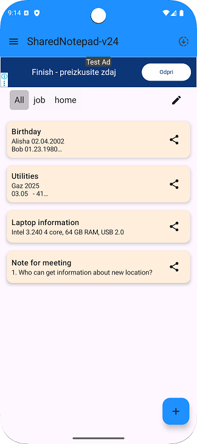
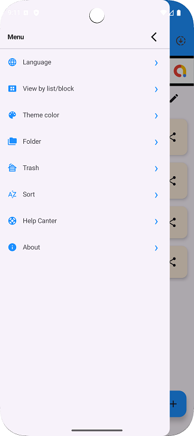
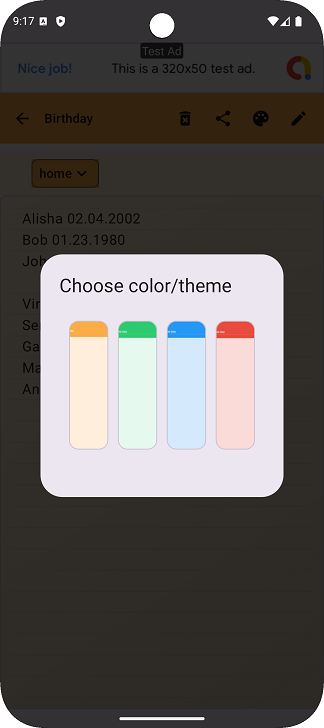
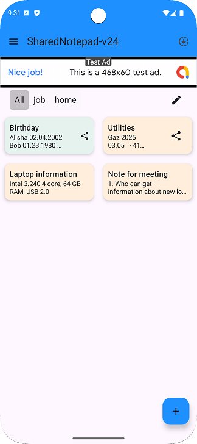

#  SharedNote

SharedNote is a simple and convenient **note-taking Android application** built with **Kotlin** and **Jetpack Compose**.  
It is designed to demonstrate **clean architecture, modern UI with Compose, multi-language support, local persistence, and integration with Google services (AdMob)**.

---

## ✨ Features

- 📝 Create, edit and delete notes with titles and content
- 🎨 Highlight important notes by coloring their titles
- 📂 Organize notes into folders
- 🌍 Multi-language support (English, Ukrainian, Russian)
- 🗂 Switch between **list** and **grid** view modes
- 🔀 Sort notes by different parameters
- 📤 Share notes as plain text via any messenger (Telegram, email, etc.)
- 🔄 Share notes between devices running SharedNote
- 🎨 Custom themes and note appearance personalization
- 📺 **Modern UI built entirely with Jetpack Compose**
- 📢 Google AdMob integration for ads

---

## 📷 Screenshots

&nbsp;&nbsp;&nbsp;&nbsp;&nbsp;&nbsp;&nbsp;&nbsp;&nbsp;&nbsp;&nbsp;&nbsp;&nbsp;&nbsp;&nbsp;&nbsp;

---

## 🛠 Tech Stack

- **Kotlin**
- **Jetpack Compose** – declarative UI toolkit (Material3, Composables, Scaffold, LazyColumn, etc.)
- **Jetpack Components**:
  - ViewModel
  - Room Database (for local persistence)
  - Navigation
- **Coroutines & Flow** – asynchronous operations and reactive UI updates
- **ActivityResult API** – for system interactions (e.g., sharing)
- **Google AdMob** – for in-app advertising

---

## 📁 Project Highlights

- 🏗 Built with **MVVM architecture** and clean separation of concerns
- ⚡ Reactive UI with **Compose + StateFlow**
- 🗄 Database-driven app with **Room**, handling folders & notes with migrations
- 🌍 Internationalization (English, Russian, Ukrainian)
- 🎨 **Full Compose UI**: no XML layouts, all screens described as Composables
- 📢 Integration with **Google AdMob** (ads handling & privacy policy compliance)

---

## 📁 Project Structure

app/  
├── colors/ &nbsp;&nbsp;&nbsp;&nbsp;&nbsp;&nbsp;&nbsp;&nbsp;&nbsp;&nbsp;&nbsp;&nbsp;&nbsp;&nbsp;&nbsp;&nbsp; &nbsp;&nbsp;&nbsp; # Color palette definitions and color group objects (used in note editor and theming)<br>
├── dao/ &nbsp;&nbsp;&nbsp;&nbsp;&nbsp;&nbsp;&nbsp;&nbsp;&nbsp;&nbsp;&nbsp;&nbsp;&nbsp;&nbsp;&nbsp;&nbsp;&nbsp;&nbsp;&nbsp;&nbsp;&nbsp;&nbsp;&nbsp; # Data Access Objects (Room DAO interfaces)<br>
├── data/ &nbsp;&nbsp;&nbsp;&nbsp;&nbsp;&nbsp;&nbsp;&nbsp;&nbsp;&nbsp;&nbsp;&nbsp;&nbsp;&nbsp;&nbsp;&nbsp;&nbsp;&nbsp;&nbsp;&nbsp;&nbsp;&nbsp; # Database setup, repositories, and MainViewModel<br>
├── dto/ &nbsp;&nbsp;&nbsp;&nbsp;&nbsp;&nbsp;&nbsp;&nbsp;&nbsp;&nbsp;&nbsp;&nbsp;&nbsp;&nbsp;&nbsp;&nbsp;&nbsp;&nbsp;&nbsp;&nbsp;&nbsp;&nbsp;&nbsp;&nbsp; # Data Transfer Objects (used for sharing/export)<br>
├── entity/ &nbsp;&nbsp;&nbsp;&nbsp;&nbsp;&nbsp;&nbsp;&nbsp;&nbsp;&nbsp;&nbsp;&nbsp;&nbsp;&nbsp;&nbsp;&nbsp;&nbsp;&nbsp;&nbsp;&nbsp; # Room entity classes (NoteEntity, FolderEntity, etc.)<br>
├── layout/ &nbsp;&nbsp;&nbsp;&nbsp;&nbsp;&nbsp;&nbsp;&nbsp;&nbsp;&nbsp;&nbsp;&nbsp;&nbsp;&nbsp;&nbsp;&nbsp;&nbsp;&nbsp;&nbsp; # Layout-related components for note presentation<br>
├── navigation/ &nbsp;&nbsp;&nbsp;&nbsp;&nbsp;&nbsp;&nbsp;&nbsp;&nbsp;&nbsp;&nbsp;&nbsp; # Navigation graph and navigation helpers<br>
├── screen/ &nbsp;&nbsp;&nbsp;&nbsp;&nbsp;&nbsp;&nbsp;&nbsp;&nbsp;&nbsp;&nbsp;&nbsp;&nbsp;&nbsp;&nbsp;&nbsp;&nbsp;&nbsp; # Jetpack Compose screens (UI for different app modules)<br>
├── settings/ &nbsp;&nbsp;&nbsp;&nbsp;&nbsp;&nbsp;&nbsp;&nbsp;&nbsp;&nbsp;&nbsp;&nbsp;&nbsp;&nbsp;&nbsp;&nbsp; # Settings screen and preference management<br>
├── share/ &nbsp;&nbsp;&nbsp;&nbsp;&nbsp;&nbsp;&nbsp;&nbsp;&nbsp;&nbsp;&nbsp;&nbsp;&nbsp;&nbsp;&nbsp;&nbsp;&nbsp;&nbsp;&nbsp;&nbsp; # Share-related functions (export/import notes, cross-device sharing)<br>
├── ui.theme/ &nbsp;&nbsp;&nbsp;&nbsp;&nbsp;&nbsp;&nbsp;&nbsp;&nbsp;&nbsp;&nbsp;&nbsp;&nbsp;&nbsp;&nbsp; # UI theming (colors, typography, shapes)<br>
└── util/ &nbsp;&nbsp;&nbsp;&nbsp;&nbsp;&nbsp;&nbsp;&nbsp;&nbsp;&nbsp;&nbsp;&nbsp;&nbsp;&nbsp;&nbsp;&nbsp;&nbsp;&nbsp;&nbsp;&nbsp;&nbsp;&nbsp;&nbsp;&nbsp; # Utility classes and helper functions<br>

---

## 🔒 Privacy & Security

- 🚫 No registration or login required
- 🚫 No cloud storage – all notes are stored **locally on the device**
- ✅ Data leaves the device only if the user explicitly shares it
- 📢 [Privacy Policy](https://maksimtest.github.io/SharedNotebook/privacy-policy.html)

---

## 📦 Installation

The app will be available on **Google Play** (planned release).  
For now, you can clone the repo and build it locally:

```bash
git clone https://github.com/yourusername/SharedNote.git
open in Android Studio
Run ▶️
```

